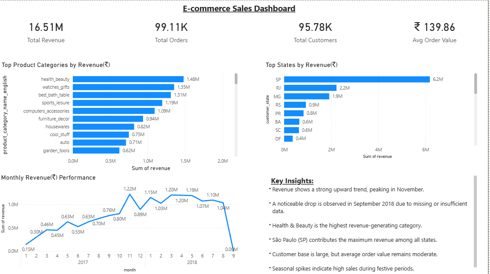

# E-Commerce Sales Analysis Forecasting

## Project Overview

This project analyzes an e-commerce dataset to understand sales trends, customer behavior, and product performance. It also includes a basic forecasting model to predict future sales.

## Objectives

* Analyze sales trends over time
* Identify top-performing product categories
* Understand regional sales distribution
* Study customer purchasing behavior
* Build a simple forecasting model

## Technologies

* Python
* SQL
* Power BI
* Scikit-learn

## Tools & Libraries

* Pandas
* NumPy
* Matplotlib
* SQLite
* Microsoft Power BI

## Dataset

Brazilian E-Commerce Public Dataset (Olist)
Includes data on orders, customers, products, payments, and sellers.

## Data Analysis

* Explored dataset structure and relationships
* Analyzed monthly revenue trends
* Identified seasonal patterns
* Studied customer purchase behavior

## SQL Analysis

* Performed joins and aggregations
* Calculated total revenue
* Identified top products and categories
* Analyzed region-wise sales

## Dashboard (Power BI)

* KPI cards: Revenue, Orders, Customers, AOV
* Monthly revenue trend
* Top product categories
* Region-wise sales analysis
* Business insights section

## Machine Learning

* Built Linear Regression model for forecasting
* Used time as independent variable
* Evaluated using Mean Absolute Error (MAE ≈ 264K)

## Key Insights

* Revenue shows steady growth with seasonal fluctuations
* A few categories contribute most of the revenue
* Sales are concentrated in key regions
* Customer repeat purchases are relatively low
* Final month drop is due to incomplete data

## Conclusion

This project demonstrates end-to-end data analysis, including data exploration, SQL querying, visualization, and basic forecasting. It provides actionable insights for business decision-making.

## 📊 Dashboard Preview

